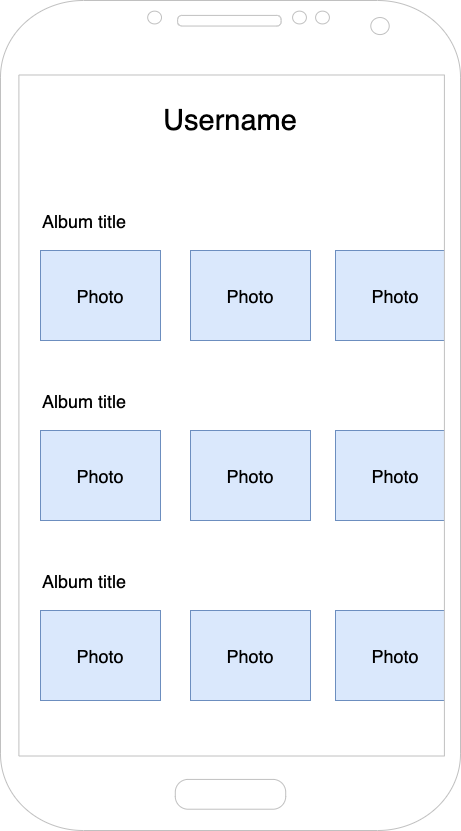

# SumUp Bank - Mobile challenge

## Goal:

#### Develop an app that allows an user to see their albuns and respective photos.

- [ ] Faça um Fork this repo. Keep it public until we have been able to review it.
- [ ] Android: _Kotlin_, _Swift_, _React Native_ or _Flutter_
- [ ] Albums and photos must be fetched from https://jsonplaceholder.typicode.com/
- [ ] Albums should be persisted locally and updated when new data available
- [ ] App should allow to switch user

### Evaluation:
- [ ] App operates as asked
- [ ] No crashes or bugs
- [ ] SOLID principles
- [ ] Code is understandable and maintainable
- [ ] Tests are present

### Suggestions: 
- Have an input field with a drop-down user selection to change the user.

## UI suggestion

